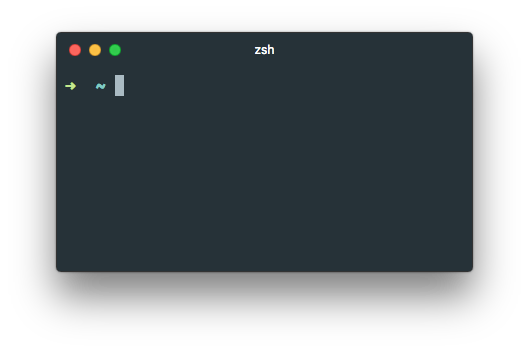
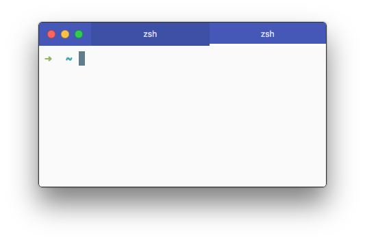

# hypeterm-material-theme
HyperTerm theme inspired on [atom-material-ui](https://github.com/atom-material/atom-material-ui) and [atom-material-syntax](https://github.com/atom-material/atom-material-syntax) packages for [Atom](https://atom.io/) editor.




### Install
Add `hyperterm-material-theme` to plugins list on your `.hyperterm.js` file.

```javascript
// ...
plugins: ['hyperterm-material-theme']
// ...
```

### Configuration





Add `materialTheme` option with your desired color to tint terminal tabs.

```javascript
config: {
  // ...
  materialTheme: 'teal'
}
```

Available colors: `amber`, `blue`, `blueGrey`, `brown`, `cyan`, `green`, `grey`, `indigo`, `lime`, `orange`, `pink`,  `purple`, `red`, and `teal`.

Also you can choose between `dark` (default) and `light` syntax variants by adding `materialSyntax`.

```javascript
config: {
  // ...
  materialSyntax: 'light'
}
```
